[Kembali](README.md)

Praktikum Sistem Terdistribusi Dan Terdesentralisasi Minggu 01 <br>
Dosen Mata Kuliah: Dr.Bambang Purnomosidi D. P.<br>
Penginstalan Git<br>
Disusun Oleh Basilius Rivalno<br>
NIM: 255410027<br>

Pada praktikum ini, perangkat saya menggunakan sistem operasi Windows 11 untuk menginstal Git serta menggunakan versi terbaru yaitu versi 2.56.0.Jadi, langkah - langkah nya adalah sebagai berikut:

1.Download Git dari Internet melalui website [Git](https://git-scm.com/) lalu pergi ke bagian Instal dan pilih sistem operasi Windows.
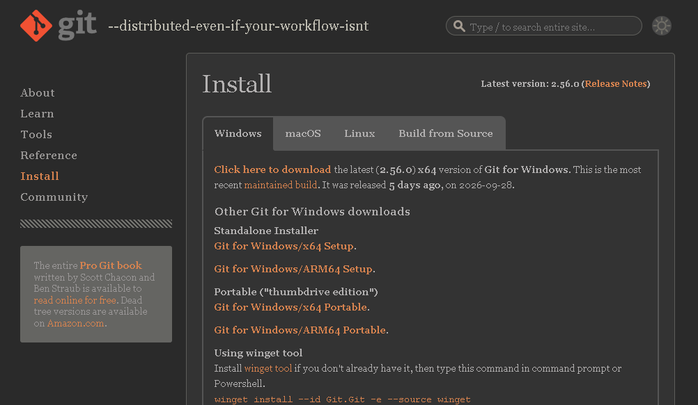 

2.Setelah file Git telah didownload, buka file tersebut dan akan menampilkan tampilan seperti dibawah lalu klik next.
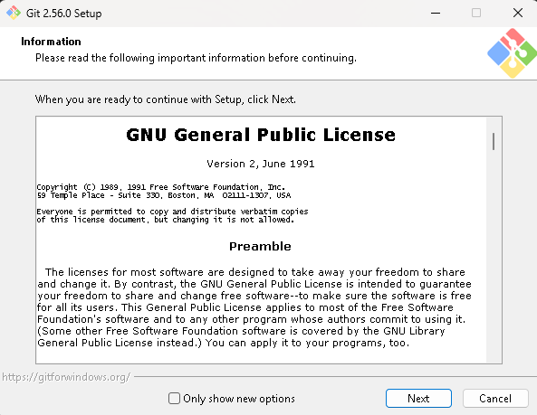

3.Pilih pada folder mana Git akan diinstal. disini menggunakan folder <i>default</i>.
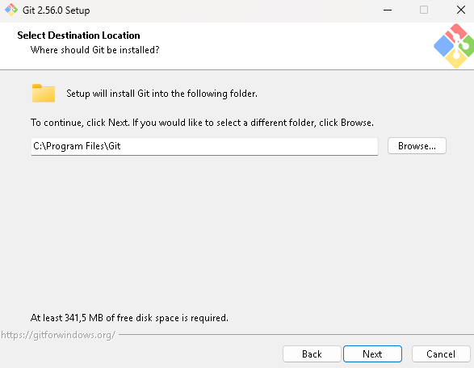

4.Pada bagian <i>Select Component</i> jangan mengubah apapun atau biarkan saja <i>default</i>.
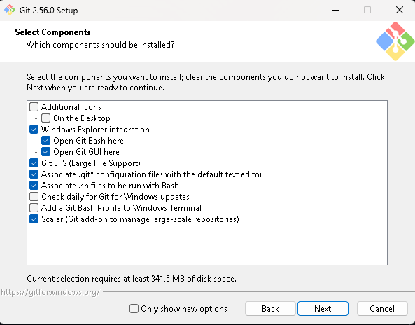

5.Pilih editor teks yang ingin digunakan. Saya menggunakan <i>Visual Studio Code</i> sebagai editor untuk Git.
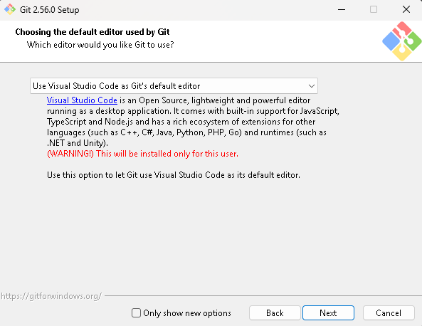

6.Pilih <i>Branch</i> yang akan digunakan untuk <i>Repository</i> disini dipilih nama <i>Branch</i> adalah <i>Main</i>.
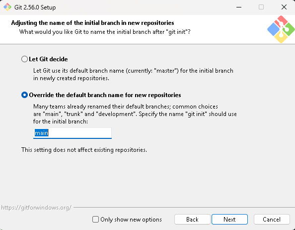

7.Pilih bagaimana Git akan diakses. disediakan pilihan untuk mengakses menggunakan <i>Bash</i> dari Linux atau <i>Command Prompt</i> pada Windows.<br>
Saya memilih pilihan kedua agar bisa mengakses menggunakan kedua antarmuka tersebut.
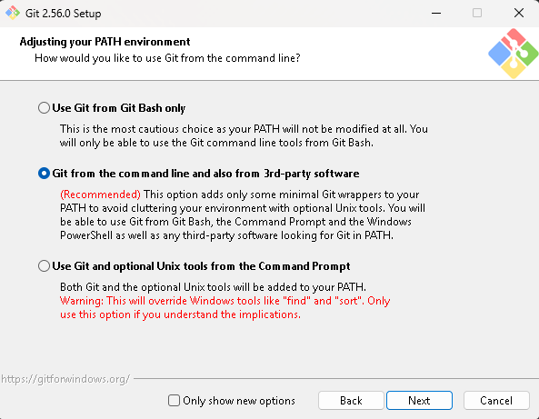

8.Pilih program SSH yang akan digunakan untuk terhubung ke GitHub. disini saya memilih <i>default</i> yaitu <i>Use Bundled OpenSSH</i>
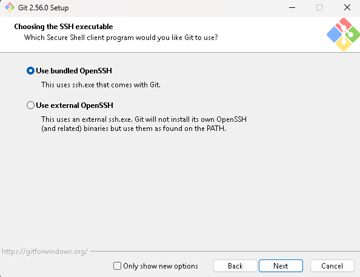

9.Pada bagian ini, pilih <i>Native Window Secure Channel Library</i> untuk HTTPS nya agar Git bisa mengakses repo GitHub
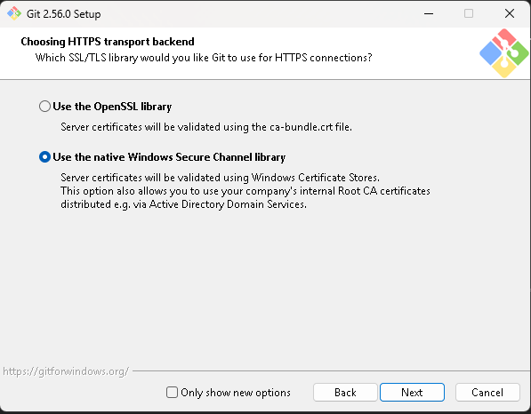

10.Pilih pilihan pertama atau <i>default</i> untuk konversi akhir baris pada bagian <i>Configuring The Line Ending</i>
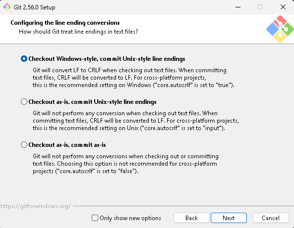

11.Pada bagian minTTY untuk terminal yang akan digunakan untuk Git Bash
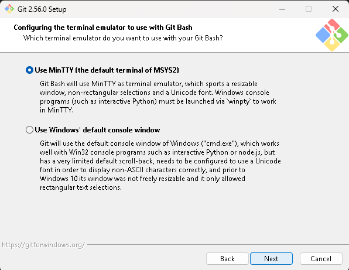

12.Pilih <i>Git credential helper</i>, lalu lanjut dengan menunggu penginstallan Git
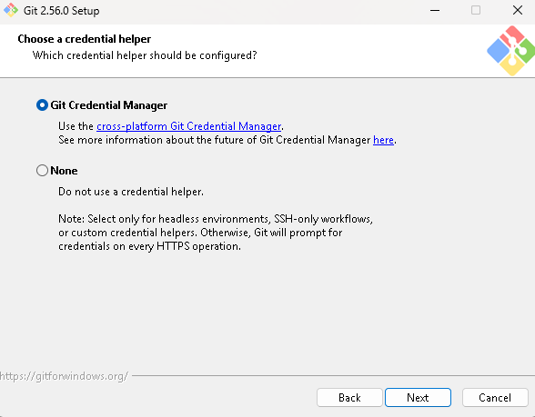

13.Jika Git sudah terinstall, maka akan muncul layar seperti ini
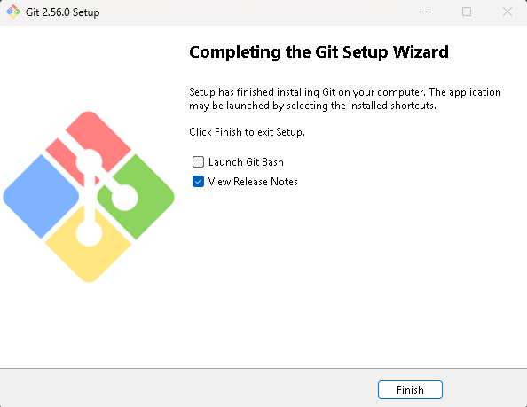

14.Untuk melihat Git apakah sudah terinstall atau belum, maka bisa menjalankan melalui Command Prompt dengan mengetik "git"
```prompt
PS C:\Users\The RIV> git
usage: git [-v | --version] [-h | --help] [-C <path>] [-c <name>=<value>]
           [--exec-path[=<path>]] [--html-path] [--man-path] [--info-path]
           [-p | --paginate | -P | --no-pager] [--no-replace-objects] [--no-lazy-fetch]
           [--no-optional-locks] [--no-advice] [--bare] [--git-dir=<path>]
           [--work-tree=<path>] [--namespace=<name>] [--config-env=<name>=<envvar>]
           <command> [<args>]

These are common Git commands used in various situations:

start a working area (see also: git help tutorial)
   clone      Clone a repository into a new directory
   init       Create an empty Git repository or reinitialize an existing one

work on the current change (see also: git help everyday)
   add        Add file contents to the index
   mv         Move or rename a file, a directory, or a symlink
   restore    Restore working tree files
   rm         Remove files from the working tree and from the index

examine the history and state (see also: git help revisions)
   bisect     Use binary search to find the commit that introduced a bug
   diff       Show changes between commits, commit and working tree, etc
   grep       Print lines matching a pattern
   log        Show commit logs
   show       Show various types of objects
   status     Show the working tree status

grow, mark and tweak your common history
   backfill   Download missing objects in a partial clone
   branch     List, create, or delete branches
   commit     Record changes to the repository
   history    EXPERIMENTAL: Rewrite history
   merge      Join two or more development histories together
   rebase     Reapply commits on top of another base tip
   reset      Set `HEAD` or the index to a known state
   switch     Switch branches
   tag        Create, list, delete or verify tags

collaborate (see also: git help workflows)
   fetch      Download objects and refs from another repository
   pull       Fetch from and integrate with another repository or a local branch
   push       Update remote refs along with associated objects

'git help -a' and 'git help -g' list available subcommands and some
concept guides. See 'git help <command>' or 'git help <concept>'
to read about a specific subcommand or concept.
See 'git help git' for an overview of the system.
```
