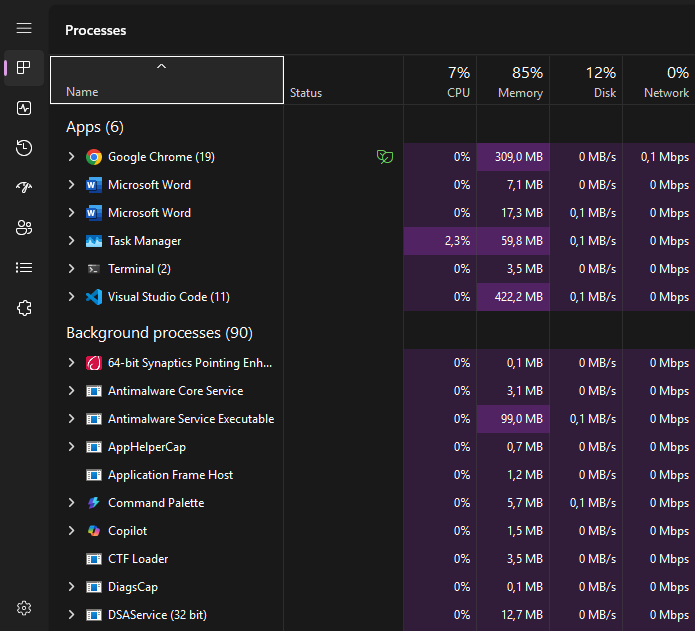
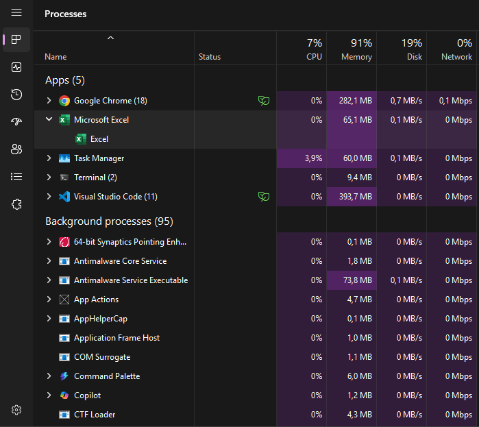
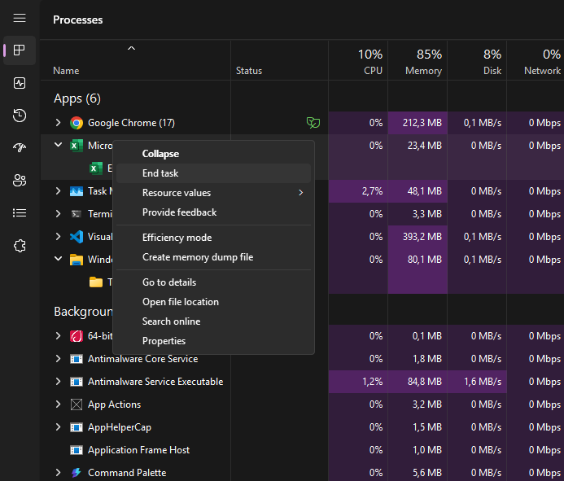
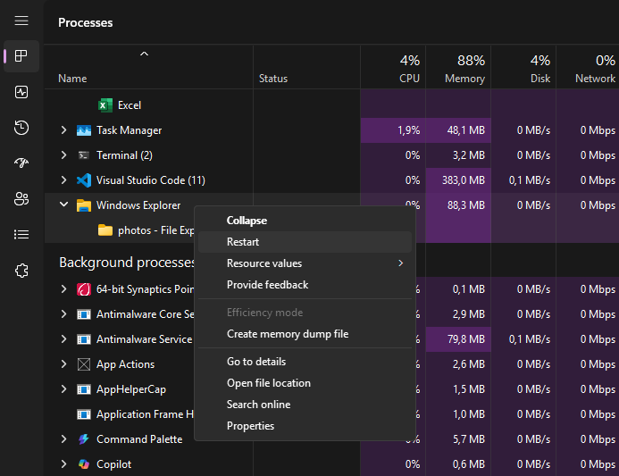

[Kembali](README.md)

PRAKTIKUM SISTEM TERDESENTRALISASI DAN TERDISTRIBUSI  
Minggu 02 
Nama: Basilius Rivalno 
NIM: 255410027 
Dosen: Dr. Bambang Purnomosidi D. P. 

Tugas 1 
1. Menampilkan proses pada komputer 

2. Menjalankan salah satu aplikasi (Excel) dan memperhatikan proses berjalannya aplikasi tersebut 

3. Mematikan dan merestart proses 
a. Mematikan proses dapat melalui klik kanan lalu klik end task pada aplikasi yang sedang berjalan

b. merestart proses aplikasi yang sedang berjalan

